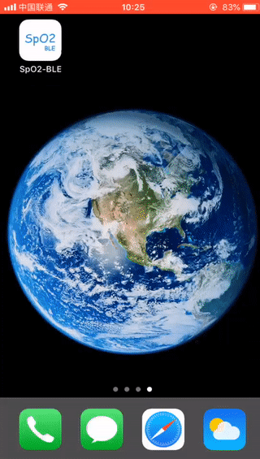

## SpO2-BLE-for-iOS

This demo show you how to connect the **BLE Oximeters**, obtain & parse data, and display the pulse waveform. For protocol details， please refer  the paper <https://github.com/zh2x/BCI_Protocol>

该demo用于演示如何连接 **BLE 蓝牙血氧仪**，获取并解析数据以及显示脉搏波形。关于协议细节可以参考协议文档 <https://github.com/zh2x/BCI_Protocol>

